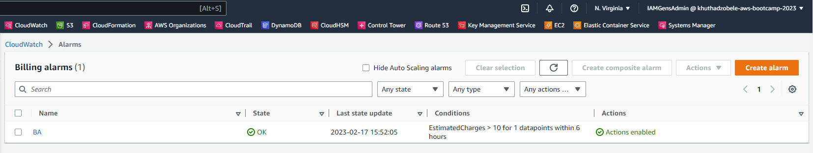
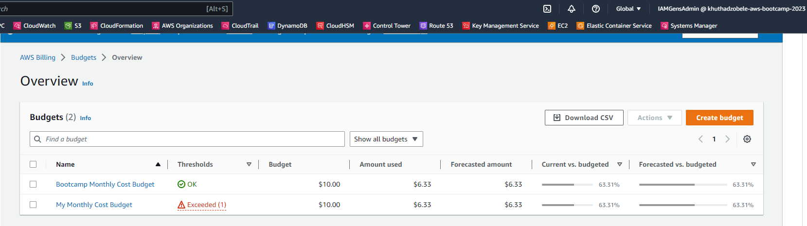

# Week 0 — Billing and Architecture
## Required Homework Tasks
## Recreated the Cruddur-2023 Logical Architecture Design
### Cruddur 2023 Architecture diagram


### Lucid Chart Share Link
[Cruddur lucidchart achitecture link](https://lucid.app/lucidchart/67e3cab9-e947-4ce6-8689-65e505880cf0/edit?viewport_loc=340%2C55%2C936%2C1041%2C0_0&invitationId=inv_322d8550-283c-48da-90dc-2f311bd8ff14)

## Install AWS CLI
### Step 1: AWS CLI installed and updated the AWS CLI on GitPod by following the instructions below:
[Install AWS CLI Instructions](https://docs.aws.amazon.com/cli/latest/userguide/getting-started-install.html)

### Updated my gitpod.yml to include the following task.
Below is the command used:
```
tasks:
  - name: aws-cli
    env:
      AWS_CLI_AUTO_PROMPT: on-partial
    init: |
      cd /workspace
      curl "https://awscli.amazonaws.com/awscli-exe-linux-x86_64.zip" -o "awscliv2.zip"
      unzip awscliv2.zip
      sudo ./aws/install
      cd $THEIA_WORKSPACE_ROOT
```

### Step2: Add Environment variables to configure the AWS CLI:
[Add enviroment variables instructions](https://docs.aws.amazon.com/cli/latest/userguide/cli-configure-envvars.html)

## Creating a Billing Alarm
### Created a $10 cloudwatch billing alarm


## Create an AWS Budgets
### I set up $10 monthly budget for my aws account and for the bootcamp

