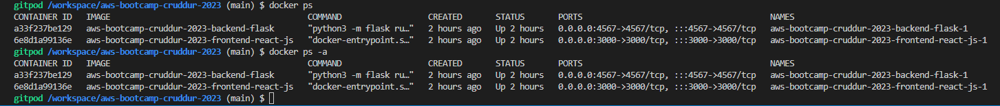
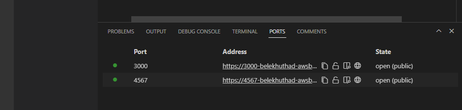
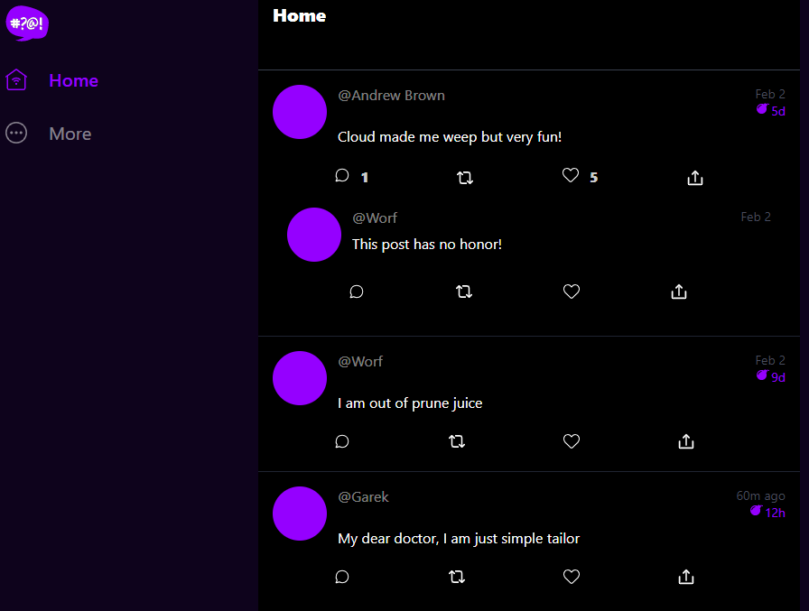
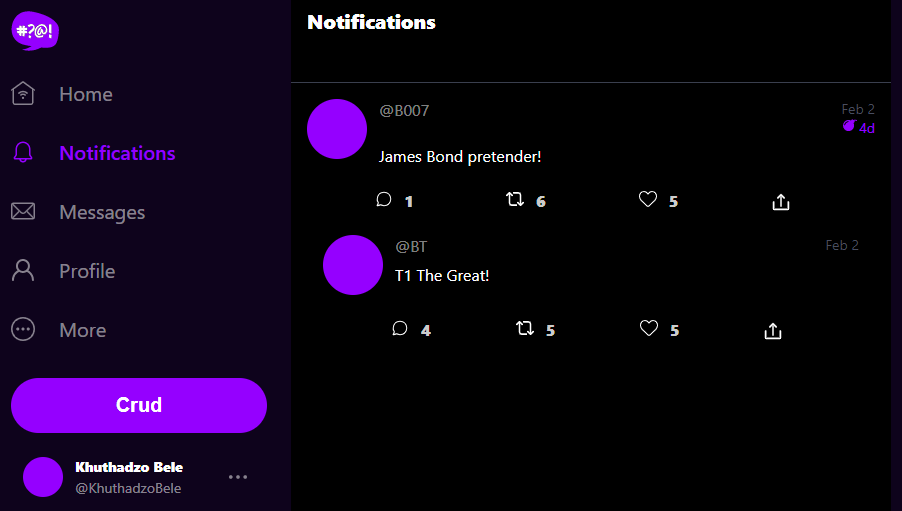
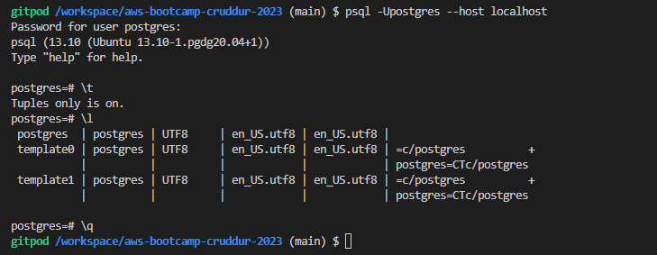

# Week 1 — App Containerization
A challenging and yet fulfilling week 1, here is how it went down:

## Containerized the Backend
### Add Dockerfile
I followed week 1 instructions to add a Dockerfile within the backend application and added the below docker configurations of how the application will run: <br>
```
FROM python:3.10-slim-buster

# Inside Container - Directory
WORKDIR /backend-flask

# cp the req txt that contains the libraries to run the app from Outside > Inside the container
COPY requirements.txt requirements.txt

# Inside Container - install py lib for the app
RUN pip3 install -r requirements.txt

# cp /backend-flask from Out > In
COPY . .

# Set ENV variables inside the container
ENV FLASK_ENV=development

EXPOSE ${PORT}

# Run Flask -module (flask)
CMD [ "python3", "-m" , "flask", "run", "--host=0.0.0.0", "--port=4567"]
```
### Run Flask
Within the backend-flask directory, i ran the below python script to install flask module locally, open port 4567 and set BACKEND_URL and FRONTEND_URL envars:<br>
```
cd backend-flask
export FRONTEND_URL="*"
export BACKEND_URL="*"
python3 -m flask run --host=0.0.0.0 --port=4567
cd ..
```
### Build a Container
First i unset the FRONTEND/BACKEND envars which i'd set above and then ran the command below to build the container: <br>
```
# -t (tags the docker image with "latest" default tag if tag unspecified)
docker build -t  backend-flask ./backend-flask
```
### Run Container
Run Command
```
# -e (injests enviroment variables), The --rm flag is there to tell the Docker Daemon to clean up the container and remove the file system after the container exits. 
docker run --rm -p 4567:4567 -it -e FRONTEND_URL='*' -e BACKEND_URL='*' backend-flask
```
## Containerized the Front-end
Change directory to front-end-react-js/ and install npm with the below commands <br>
```
cd frontend-react-js
npm i
```
### Create the front-and Dockerfile and insert the required configurations <br>
```
FROM node:16.18

ENV PORT=3000

COPY . /frontend-react-js
WORKDIR /frontend-react-js
RUN npm install
EXPOSE ${PORT}
CMD ["npm", "start"]
```
### Get Frontend/Backend Container Images with (docker ps/ps -a)


## Multiple Containers - The ```docker-compose.yml``` file
This is to run multiple containers at the same time <br>
```
version: "3.8"
services:
  backend-flask:
    environment:
      FRONTEND_URL: "https://3000-${GITPOD_WORKSPACE_ID}.${GITPOD_WORKSPACE_CLUSTER_HOST}"
      BACKEND_URL: "https://4567-${GITPOD_WORKSPACE_ID}.${GITPOD_WORKSPACE_CLUSTER_HOST}"
    build: ./backend-flask
    ports:
      - "4567:4567"
    volumes:
      - ./backend-flask:/backend-flask
  frontend-react-js:
    environment:
      REACT_APP_BACKEND_URL: "https://4567-${GITPOD_WORKSPACE_ID}.${GITPOD_WORKSPACE_CLUSTER_HOST}"
    build: ./frontend-react-js
    ports:
      - "3000:3000"
    volumes:
      - ./frontend-react-js:/frontend-react-js
  
  # run emulation of dynamodb
  dynamodb-local:
    # https://stackoverflow.com/questions/67533058/persist-local-dynamodb-data-in-volumes-lack-permission-unable-to-open-databa
    # We needed to add user:root to get this working.
    user: root
    command: "-jar DynamoDBLocal.jar -sharedDb -dbPath ./data"
    image: "amazon/dynamodb-local:latest"
    container_name: dynamodb-local
    ports:
      - "8000:8000"
    volumes:
      - "./docker/dynamodb:/home/dynamodblocal/data"
    working_dir: /home/dynamodblocal

  db:
    image: postgres:13-alpine
    restart: always
    environment:
      - POSTGRES_USER=postgres
      - POSTGRES_PASSWORD=password
    ports:
      - '5432:5432'
    volumes: 
      - db:/var/lib/postgresql/data

# the name flag is a hack to change the default prepend folder
# name when outputting the image names
networks: 
  internal-network:
    driver: bridge
    name: cruddur

# store db locally on machine
volumes:
  db:
    driver: local
```

### Run the ```docker compose up``` to aggregates the output of each container
Below are the outputs:<br>

### Opened ports (3000/4567)


### Front-End Application ()
I shed a tear here, literally. I even altered the message on display.


## Create the notificaton feature

## BackEnd
### Add notifications endpoint
Updated the ```openapi-3.0.yml``` file to add the notifications endpoint with the code below:<br>

```
  /api/activities/notification:
    get:
      description: 'Return a feed of activity for all of those that I follow'
      tags:
        - activities
      parameters: []
      responses:
        '200':
          description: Returns an array of activities
          content:
            application/json:
              schema:
                type: array
                items:
                  $ref: '#/components/schemas/Activity'
```

### Updated the ```app.py```
```
@app.route("/api/activities/notifications", methods=['GET'])
def data_notifications():
  data = NotificationsActivities.run()
  return data, 200
```
### Updated the ```notifications_activities.py``` with the following code:
```
from datetime import datetime, timedelta, timezone
class NotificationsActivities:
  def run():
    now = datetime.now(timezone.utc).astimezone()    
    results = [{
      'uuid': '68f126b0-1ceb-4a33-88be-d90fa7109eee',
      'handle':  'B007',
      'message': 'James Bond pretender!',
      'created_at': (now - timedelta(days=2)).isoformat(),
      'expires_at': (now + timedelta(days=5)).isoformat(),
      'likes_count': 5,
      'replies_count': 1,
      'reposts_count': 6,
      'replies': [{
        'uuid': '26e12864-1c26-5c3a-9658-97a10f8fea67',
        'reply_to_activity_uuid': '68f126b0-1ceb-4a33-88be-d90fa7109eee',
        'handle':  'BT',
        'message': 'T1 The Great!',
        'likes_count': 5,
        'replies_count': 4,
        'reposts_count': 5,
        'created_at': (now - timedelta(days=2)).isoformat()
      }],
    },
    ]
    return results
```
## Front-End
I followed the instructions and updated the ```App.js``` file to include NotificationsFeedPage, and path. Created and updated the ```NotificationsFeedPage.js```<br>

### Notification Activity Result


## DynamoDB and Postgres
I added DynamoDB and Postgres istallations codes and volume in the ```docker-compose``` file above.<br>

I followed instructions and updated the gitpod.yml file to install the postgres driver on startup with the code below:<br>
```
  - name: postgres
    init: |
      curl -fsSL https://www.postgresql.org/media/keys/ACCC4CF8.asc|sudo gpg --dearmor -o /etc/apt/trusted.gpg.d/postgresql.gpg
      echo "deb http://apt.postgresql.org/pub/repos/apt/ `lsb_release -cs`-pgdg main" |sudo tee  /etc/apt/sources.list.d/pgdg.list
      sudo apt update
      sudo apt install -y postgresql-client-13 libpq-dev
```
### Login to Postgres

