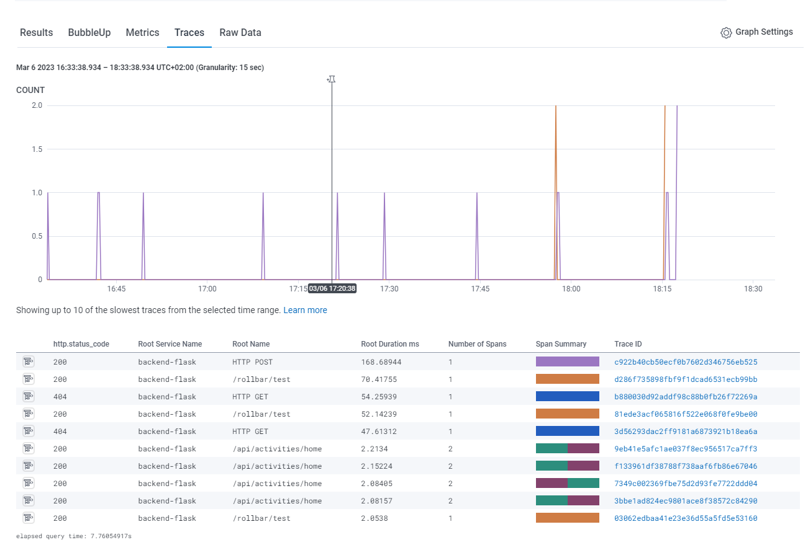
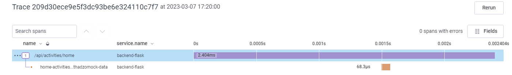
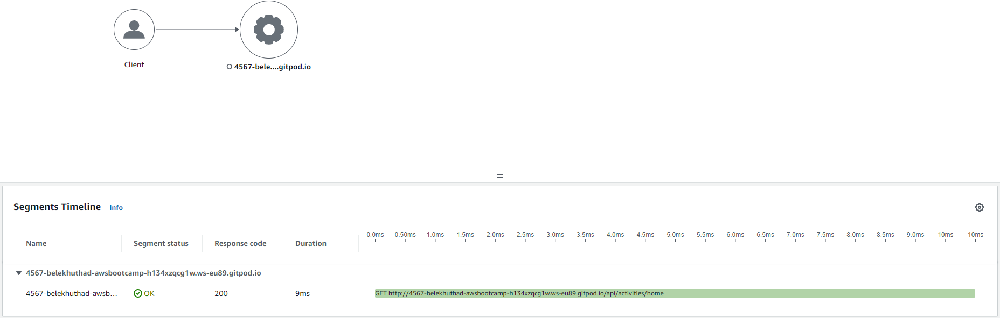
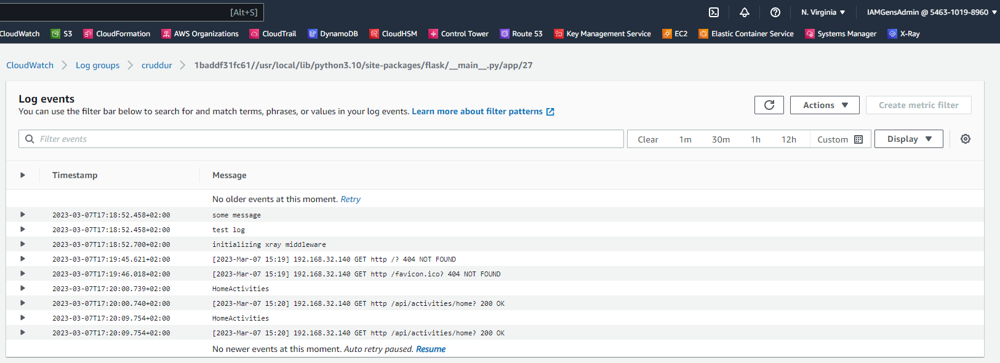
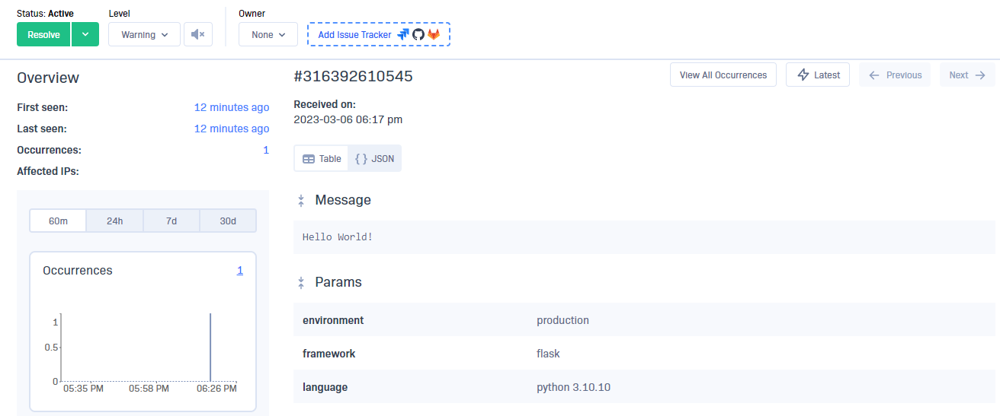

# Week 2 — Distributed Tracing
This week was focused on adding observability, monitoring and logging (Distributed Tracing) to the application, I managed to follow the guidlines and implemented Honeycomb, X-Ray, AWS CloudWatch Logs and Rollbar succesfully and have them function as intended.

## HoneyComb
#### Added Honeycomb API enviroment variables and key, this will allow events to be sent to Honeycomb.
```
export HONEYCOMB_API_KEY=""
export HONEYCOMB_SERVICE_NAME="Cruddur"
gp env HONEYCOMB_API_KEY=""
gp env HONEYCOMB_SERVICE_NAME="Cruddur"
```
#### Added the following Enviroment Variables to ```backend-flask``` in docker compose file.
This configures OpenTelemetry (OTEL) to send events to Honeycomb using environment variables.
```
OTEL_EXPORTER_OTLP_ENDPOINT: "https://api.honeycomb.io"
OTEL_EXPORTER_OTLP_HEADERS: "x-honeycomb-team=${HONEYCOMB_API_KEY}"
OTEL_SERVICE_NAME: "${HONEYCOMB_SERVICE_NAME}"
```
#### Installed these packages to instrument a Flask app with OpenTelemetry by adding it to ```backend-flask/``` ```requirements.txt``` and ran the ```pip install -r requirements.txt``` to intall packages.
This will be used to instrument the application to send telemetry data to Honeycomb.

```
# Honeycomb ---
opentelemetry-api 
opentelemetry-sdk 
opentelemetry-exporter-otlp-proto-http 
opentelemetry-instrumentation-flask 
opentelemetry-instrumentation-requests
```
#### Initialize Honeycomb
Added the following code to ```app.py``` to initialize a tracer and Flask instrumentation to send data to Honeycomb.
```
from opentelemetry import trace
from opentelemetry.instrumentation.flask import FlaskInstrumentor
from opentelemetry.instrumentation.requests import RequestsInstrumentor
from opentelemetry.exporter.otlp.proto.http.trace_exporter import OTLPSpanExporter
from opentelemetry.sdk.trace import TracerProvider
from opentelemetry.sdk.trace.export import BatchSpanProcessor
```
```
# Initialize tracing and an exporter that can send data to Honeycomb
provider = TracerProvider()
processor = BatchSpanProcessor(OTLPSpanExporter())
provider.add_span_processor(processor)
trace.set_tracer_provider(provider)
tracer = trace.get_tracer(__name__)
```
```
# Initialize automatic instrumentation with Flask
FlaskInstrumentor().instrument_app(app)
RequestsInstrumentor().instrument()
```
#### Honeycomb Traces

#### Created a tracer to create a ```home.activities``` span and added attributes ```home-activities-khuthadzomock-data``` to the span
```
# creating home.activities span
from opentelemetry import trace
tracer = trace.get_tracer("home.activities")
```
```
# Add attributes to span
    with tracer.start_as_current_span("home-activities-khuthadzomock-data"):
       span = trace.get_current_span()
       now = datetime.now(timezone.utc).astimezone()
       span.set_attribute("app.now", now.isoformat())
```

## X-Ray
#### Added the SDK as a dependency to ```requirements.txt``` file and installed the package
```
aws-xray-sdk
```
#### Added the middleware for flask to the application to instrument https requests in the ```app.py```
```
from aws_xray_sdk.core import xray_recorder
from aws_xray_sdk.ext.flask.middleware import XRayMiddleware

xray_url = os.getenv("AWS_XRAY_URL")
xray_recorder.configure(service='backend-flask', dynamic_naming=xray_url)
XRayMiddleware(app, xray_recorder)
```
#### Configured the SDK to load sampling rules from a JSON document. 
```
{
  "SamplingRule": {
      "RuleName": "Cruddur",
      "ResourceARN": "*",
      "Priority": 9000,
      "FixedRate": 0.1,
      "ReservoirSize": 5,
      "ServiceName": "backend-flask",
      "ServiceType": "*",
      "Host": "*",
      "HTTPMethod": "*",
      "URLPath": "*",
      "Version": 1
  }
}
```
#### X-Ray group (group traces together) and create sampling rule through aws cli
##### X-Ray Group
```
FLASK_ADDRESS="https://4567-${GITPOD_WORKSPACE_ID}.${GITPOD_WORKSPACE_CLUSTER_HOST}"
aws xray create-group \
   --group-name "Cruddur" \
   --filter-expression "service(\"$backend-flask\")"
```
##### Sampling rule
```
aws xray create-sampling-rule --cli-input-json file://aws/json/xray.json
```
#### Added AWS X-Ray daemon to ```docker-compose.yml``` file
```
  xray-daemon:
    image: "amazon/aws-xray-daemon"
    environment:
      AWS_ACCESS_KEY_ID: "${AWS_ACCESS_KEY_ID}"
      AWS_SECRET_ACCESS_KEY: "${AWS_SECRET_ACCESS_KEY}"
      AWS_REGION: "us-east-1"
    command:
      - "xray -o -b xray-daemon:2000"
    ports:
      - 2000:2000/udp
```
Added Enviroment variable to ```docker-compose.yml```
```
AWS_XRAY_URL: "*4567-${GITPOD_WORKSPACE_ID}.${GITPOD_WORKSPACE_CLUSTER_HOST}*"
AWS_XRAY_DAEMON_ADDRESS: "xray-daemon:2000"
```
#### X-Ray Traces and Service map 

## AWS Cloudwatch Logs
#### Add ```watchtower``` to the ```requirements.txt```.
Watchtower is a log handler for Amazon Web Services CloudWatch Logs.
#### Load configuration into the application ```app.py```
```
import watchtower
import logging
from time import strftime
```
```
# Configuring Logger to Use CloudWatch
LOGGER = logging.getLogger(__name__)
LOGGER.setLevel(logging.DEBUG)
console_handler = logging.StreamHandler()
cw_handler = watchtower.CloudWatchLogHandler(log_group='cruddur')
LOGGER.addHandler(console_handler)
LOGGER.addHandler(cw_handler)
LOGGER.info("some message")
```
```
# Error Logging
@app.after_request
def after_request(response):
    timestamp = strftime('[%Y-%b-%d %H:%M]')
    LOGGER.error('%s %s %s %s %s %s', timestamp, request.remote_addr, request.method, request.scheme, request.full_path, response.status)
    return response
```
Set Env Vars in ```docker-compose.yml```
```
AWS_DEFAULT_REGION: "${AWS_DEFAULT_REGION}"
AWS_ACCESS_KEY_ID: "${AWS_ACCESS_KEY_ID}"
AWS_SECRET_ACCESS_KEY: "${AWS_SECRET_ACCESS_KEY}"
```
#### Cloudwatch log events

## Rollbar

#### Import rollbar

```
import os
import rollbar
import rollbar.contrib.flask
from flask import got_request_exception
```
```
rollbar_access_token = os.getenv('ROLLBAR_ACCESS_TOKEN')
@app.before_first_request
def init_rollbar():
    """init rollbar module"""
    rollbar.init(
        # access token
        rollbar_access_token,
        # environment name
        'production',
        # server root directory, makes tracebacks prettier
        root=os.path.dirname(os.path.realpath(__file__)),
        # flask already sets up logging
        allow_logging_basic_config=False)

    # send exceptions from `app` to rollbar, using flask's signal system.
    got_request_exception.connect(rollbar.contrib.flask.report_exception, app)
```
#### Add an endpoint for testing rollbar to ```app.py```
```
@app.route('/rollbar/test')
def rollbar_test():
    rollbar.report_message('Hello World!', 'warning')
    return "Hello World!"
```

