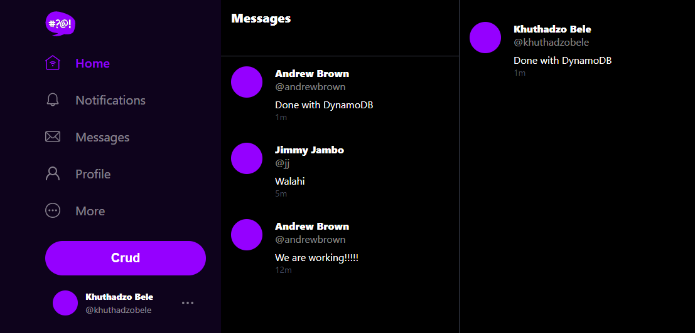
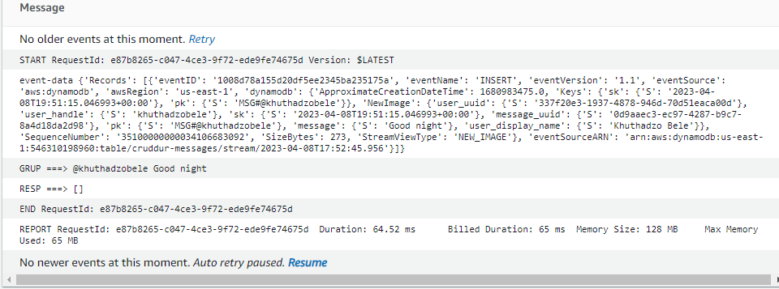

# Week 5 — DynamoDB and Serverless Caching
Week 5 was focused on implementing DynamoDB and Serverless Caching Cruddur direct messaging functionality. Implemented DynamoDB locally, seeded the data, used AWS SDK for DynamoDB, created a production DynamoDB table and lambda function to trigger message streams.

#### Install AWS Python SDK Boto3 to ```requirements.txt```
## Add DynamoDB Utility Scripts
#### Create table Schema-Load
```
#!/usr/bin/env python3

import boto3
import sys

attrs = {
  'endpoint_url': 'http://localhost:8000'
}

if len(sys.argv) == 2:
  if "prod" in sys.argv[1]:
    attrs = {}

dynamodb = boto3.client('dynamodb', **attrs)
table_name = 'cruddur-messages'

# define the schema for the table
table_schema = {
  'AttributeDefinitions': [
    {
      'AttributeName': 'message_group_uuid',
      'AttributeType': 'S'
    },{
      'AttributeName': 'pk',
      'AttributeType': 'S'
    },{
      'AttributeName': 'sk',
      'AttributeType': 'S'
    }
  ],
  'KeySchema': [{
      'AttributeName': 'pk',
      'KeyType': 'HASH'
    },{
      'AttributeName': 'sk',
      'KeyType': 'RANGE'
    }
  ],
  'BillingMode': 'PROVISIONED',
  'ProvisionedThroughput': {
      'ReadCapacityUnits': 5,
      'WriteCapacityUnits': 5
  },
  'GlobalSecondaryIndexes':[{
    'IndexName':'message-group-sk-index',
    'KeySchema':[{
      'AttributeName': 'message_group_uuid',
      'KeyType': 'HASH'
    },{
      'AttributeName': 'sk',
      'KeyType': 'RANGE'
    }],
    'Projection': {
      'ProjectionType': 'ALL'
    },
    'ProvisionedThroughput': {
      'ReadCapacityUnits': 5,
      'WriteCapacityUnits': 5
    },
  }]
}

# create the table
response = dynamodb.create_table(
    TableName=table_name,
    **table_schema
)

# print the response
print(response)
```
#### Listing tables
```
#! /usr/bin/bash

if [ "$1" = "prod" ]; then
  ENDPOINT_URL=""
else
  ENDPOINT_URL="--endpoint-url=http://localhost:8000"
fi

aws dynamodb list-tables  $ENDPOINT_URL \
  --query TableNames \
  --output table
```
#### Drop table
```
#! /usr/bin/bash

set -e # stop if it fails at any point

if [ -z "$1" ]; then
  echo "No TABLE_NAME argument supplied eg ./bin/ddb/drop cruddur-messages prod "
  exit 1
fi
TABLE_NAME=$1

if [ "$2" = "prod" ]; then
  ENDPOINT_URL=""
else
  ENDPOINT_URL="--endpoint-url=http://localhost:8000"
fi

echo "deleting table: $TABLE_NAME"

aws dynamodb delete-table $ENDPOINT_URL \
  --table-name $TABLE_NAME
```
#### Add Scan script to read data from a cruddur messages table in using Boto3 library.
```
#!/usr/bin/env python3

import boto3

attrs = {
  'endpoint_url': 'http://localhost:8000'
}
ddb = boto3.resource('dynamodb',**attrs)
table_name = 'cruddur-messages'

table = ddb.Table(table_name)
response = table.scan()

items = response['Items']
for item in items:
  print(item)
```
#### Assign permissions to the scripts
```
chmod u+x bin/ddb [scripts]
```

## Add ```ddb.py``` object which contains functions and classes that utilize the AWS SDK for Python (Boto3) to connect to and interact with a DynamoDB database.
```
import boto3
import sys
from datetime import datetime, timedelta, timezone
import uuid
import os
import botocore.exceptions

class Ddb:
  def client():
    endpoint_url = os.getenv("AWS_ENDPOINT_URL")
    if endpoint_url:
      attrs = { 'endpoint_url': endpoint_url }
    else:
      attrs = {}
    dynamodb = boto3.client('dynamodb',**attrs)
    return dynamodb
  def list_message_groups(client,my_user_uuid):
    year = str(datetime.now().year)
    table_name = 'cruddur-messages'
    query_params = {
      'TableName': table_name,
      'KeyConditionExpression': 'pk = :pk AND begins_with(sk,:year)',
      'ScanIndexForward': False,
      'Limit': 20,
      'ExpressionAttributeValues': {
        ':year': {'S': year },
        ':pk': {'S': f"GRP#{my_user_uuid}"}
      }
    }
    print('query-params:',query_params)
    print(query_params)
    # query the table
    response = client.query(**query_params)
    items = response['Items']
    

    results = []
    for item in items:
      last_sent_at = item['sk']['S']
      results.append({
        'uuid': item['message_group_uuid']['S'],
        'display_name': item['user_display_name']['S'],
        'handle': item['user_handle']['S'],
        'message': item['message']['S'],
        'created_at': last_sent_at
      })
    return results
  def list_messages(client,message_group_uuid):
    year = str(datetime.now().year)
    table_name = 'cruddur-messages'
    query_params = {
      'TableName': table_name,
      'KeyConditionExpression': 'pk = :pk AND begins_with(sk,:year)',
      'ScanIndexForward': False,
      'Limit': 20,
      'ExpressionAttributeValues': {
        ':year': {'S': year },
        ':pk': {'S': f"MSG#{message_group_uuid}"}
      }
    }

    response = client.query(**query_params)
    items = response['Items']
    items.reverse()
    results = []
    for item in items:
      created_at = item['sk']['S']
      results.append({
        'uuid': item['message_uuid']['S'],
        'display_name': item['user_display_name']['S'],
        'handle': item['user_handle']['S'],
        'message': item['message']['S'],
        'created_at': created_at
      })
    return results
  def create_message(client,message_group_uuid, message, my_user_uuid, my_user_display_name, my_user_handle):
    now = datetime.now(timezone.utc).astimezone().isoformat()
    created_at = now
    message_uuid = str(uuid.uuid4())

    record = {
      'pk':   {'S': f"MSG#{message_group_uuid}"},
      'sk':   {'S': created_at },
      'message': {'S': message},
      'message_uuid': {'S': message_uuid},
      'user_uuid': {'S': my_user_uuid},
      'user_display_name': {'S': my_user_display_name},
      'user_handle': {'S': my_user_handle}
    }
    # insert the record into the table
    table_name = 'cruddur-messages'
    response = client.put_item(
      TableName=table_name,
      Item=record
    )
    # print the response
    print(response)
    return {
      'message_group_uuid': message_group_uuid,
      'uuid': my_user_uuid,
      'display_name': my_user_display_name,
      'handle':  my_user_handle,
      'message': message,
      'created_at': created_at
    }
  def create_message_group(client, message,my_user_uuid, my_user_display_name, my_user_handle, other_user_uuid, other_user_display_name, other_user_handle):
    print('== create_message_group.1')
    table_name = 'cruddur-messages'

    message_group_uuid = str(uuid.uuid4())
    message_uuid = str(uuid.uuid4())
    now = datetime.now(timezone.utc).astimezone().isoformat()
    last_message_at = now
    created_at = now
    print('== create_message_group.2')

    my_message_group = {
      'pk': {'S': f"GRP#{my_user_uuid}"},
      'sk': {'S': last_message_at},
      'message_group_uuid': {'S': message_group_uuid},
      'message': {'S': message},
      'user_uuid': {'S': other_user_uuid},
      'user_display_name': {'S': other_user_display_name},
      'user_handle':  {'S': other_user_handle}
    }

    print('== create_message_group.3')
    other_message_group = {
      'pk': {'S': f"GRP#{other_user_uuid}"},
      'sk': {'S': last_message_at},
      'message_group_uuid': {'S': message_group_uuid},
      'message': {'S': message},
      'user_uuid': {'S': my_user_uuid},
      'user_display_name': {'S': my_user_display_name},
      'user_handle':  {'S': my_user_handle}
    }

    print('== create_message_group.4')
    message = {
      'pk':   {'S': f"MSG#{message_group_uuid}"},
      'sk':   {'S': created_at },
      'message': {'S': message},
      'message_uuid': {'S': message_uuid},
      'user_uuid': {'S': my_user_uuid},
      'user_display_name': {'S': my_user_display_name},
      'user_handle': {'S': my_user_handle}
    }

    items = {
      table_name: [
        {'PutRequest': {'Item': my_message_group}},
        {'PutRequest': {'Item': other_message_group}},
        {'PutRequest': {'Item': message}}
      ]
    }

    try:
      print('== create_message_group.try')
      # Begin the transaction
      response = client.batch_write_item(RequestItems=items)
      return {
        'message_group_uuid': message_group_uuid
      }
    except botocore.exceptions.ClientError as e:
      print('== create_message_group.error')
      print(e)
```
#### Add cognito file to list users in the Amazon Cognito user pool
```
#!/usr/bin/env python3

import boto3
import os
import json

userpool_id = os.getenv("AWS_COGNITO_USER_POOL_ID")
client = boto3.client('cognito-idp')
params = {
  'UserPoolId': userpool_id,
  'AttributesToGet': [
      'preferred_username',
      'sub'
  ]
}
response = client.list_users(**params)
users = response['Users']

print(json.dumps(users, sort_keys=True, indent=2, default=str))

dict_users = {}
for user in users:
  attrs = user['Attributes']
  sub    = next((a for a in attrs if a["Name"] == 'sub'), None)
  handle = next((a for a in attrs if a["Name"] == 'preferred_username'), None)
  dict_users[handle['Value']] = sub['Value']

print(json.dumps(dict_users, sort_keys=True, indent=2, default=str))
```
#### Add script to update cognito user ids
```
#!/usr/bin/env python3

import boto3
import os
import sys

print("== db-update-cognito-user-ids")

current_path = os.path.dirname(os.path.abspath(__file__))
parent_path = os.path.abspath(os.path.join(current_path, '..', '..'))
sys.path.append(parent_path)
from lib.db import db

def update_users_with_cognito_user_id(handle,sub):
  sql = """
    UPDATE public.users
    SET cognito_user_id = %(sub)s
    WHERE
      users.handle = %(handle)s;
  """
  db.query_commit(sql,{
    'handle' : handle,
    'sub' : sub
  })

def get_cognito_user_ids():
  userpool_id = os.getenv("AWS_COGNITO_USER_POOL_ID")
  client = boto3.client('cognito-idp')
  params = {
    'UserPoolId': userpool_id,
    'AttributesToGet': [
        'preferred_username',
        'sub'
    ]
  }
  response = client.list_users(**params)
  users = response['Users']
  dict_users = {}
  for user in users:
    attrs = user['Attributes']
    sub    = next((a for a in attrs if a["Name"] == 'sub'), None)
    handle = next((a for a in attrs if a["Name"] == 'preferred_username'), None)
    dict_users[handle['Value']] = sub['Value']
  return dict_users


users = get_cognito_user_ids()

for handle, sub in users.items():
  print('----',handle,sub)
  update_users_with_cognito_user_id(
    handle=handle,
    sub=sub
  )
```
## Implement conversations with DynamoDB
#### Create Message Group
```
from datetime import datetime, timedelta, timezone

from lib.ddb import Ddb
from lib.db import db

class MessageGroups:
  def run(cognito_user_id):
    model = {
      'errors': None,
      'data': None
    }

    sql = db.template('users','uuid_from_cognito_user_id')
    my_user_uuid = db.query_value(sql,{
      'cognito_user_id': cognito_user_id
    })

    print(f"UUID: {my_user_uuid}")

    ddb = Ddb.client()
    data = Ddb.list_message_groups(ddb, my_user_uuid)
    print("list_message_groups:",data)

    model['data'] = data
    return model
```
#### Add Query to generate uuid from cognito_user_id
```
SELECT
  users.uuid
FROM public.users
WHERE 
  users.cognito_user_id = %(cognito_user_id)s
LIMIT 1
```
## DynamoDB Streams
#### Created VPC Endpoint for DynamoDB Service
#### Created python Lambda function
```
import json
import boto3
from boto3.dynamodb.conditions import Key, Attr

dynamodb = boto3.resource(
    'dynamodb',
    region_name='us-east-1',
    endpoint_url="http://dynamodb.us-east-1.amazonaws.com"
)

def lambda_handler(event, context):
    print('event-data', event)

    eventName = event['Records'][0]['eventName']
    if (eventName == 'REMOVE'):
        print("skip REMOVE event")
        return

    pk = event['Records'][0]['dynamodb']['Keys']['pk']['S']
    sk = event['Records'][0]['dynamodb']['Keys']['sk']['S']
    if pk.startswith('MSG#'):
        group_uuid = pk.replace("MSG#", "")
        message = event['Records'][0]['dynamodb']['NewImage']['message']['S']
        print("GRUP ===>", group_uuid, message)

        table_name = 'cruddur-messages'
        index_name = 'message-group-sk-index'
        table = dynamodb.Table(table_name)
        data = table.query(
            IndexName=index_name,
            KeyConditionExpression=Key('message_group_uuid').eq(group_uuid)
        )
        print("RESP ===>", data['Items'])

        # recreate the message group rows with new SK value
        for i in data['Items']:
            delete_item = table.delete_item(Key={'pk': i['pk'], 'sk': i['sk']})
            print("DELETE ===>", delete_item)

            response = table.put_item(
                Item={
                    'pk': i['pk'],
                    'sk': sk,
                    'message_group_uuid': i['message_group_uuid'],
                    'message': message,
                    'user_display_name': i['user_display_name'],
                    'user_handle': i['user_handle'],
                    'user_uuid': i['user_uuid']
                }
            )
            print("CREATE ===>", response)
```
#### Sending messages in production

#### Lambda message stream logs from cloudwatch

#### Create an Inline Policy
```
{
    "Version": "2012-10-17",
    "Statement": [
        {
            "Sid": "VisualEditor0",
            "Effect": "Allow",
            "Action": [
                "dynamodb:PutItem",
                "dynamodb:DeleteItem",
                "dynamodb:Query"
            ],
            "Resource": [
                "arn:aws:dynamodb:us-east-1:546310198960:table/cruddur-messages",
                "arn:aws:dynamodb:us-east-1:546310198960:table/cruddur-messages/index/message-group-sk-index"
            ]
        }
    ]
}
```
